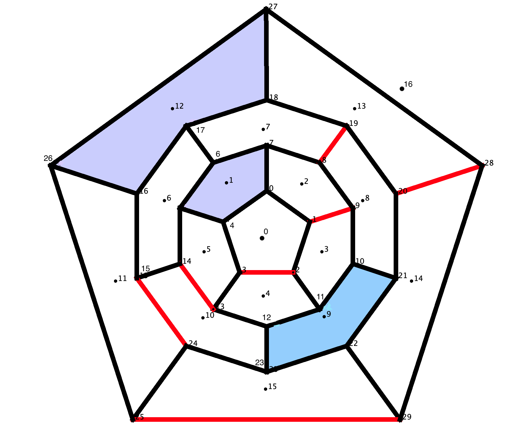

# Recursively solving for all p-anionic Clar structures of fullerenes via Integer Linear Programming

## Background

### Definitions

A **fullerene** $F_n$ is a 3-regular graph such that every face is a pentagon
or a hexagon. By Euler's formula, there are exactly 12 pentagons. Let $F(F_n)$
and $E(F_n)$ denote the set of faces and edges in a fullerene $F_n$,
respectively. For a fixed integer p, a **p-anionic resonance structure**
$(\mathcal{F}, \mathcal{M})$ of a fullerene $F_n$ is a set of independent faces
$\mathcal{F} \subseteq F(F_n)$ (containing exactly p pentagons) and a perfect
matching $\mathcal{M} \subseteq E(F_n)$ on the graph obtained from $F_n$ by
removing the vertices of the faces in $\mathcal{F}$. The **p-anionic Clar
number** $C_p(F_n)$ of a fullerene $F_n$ is defined to be zero if $F_n$ has no
p-anionic resonance structures and, otherwise, to be equal to the maximum value
of $|\mathcal{F}|$ over all p-anionic resonance structures $(\mathcal{F},
\mathcal{M})$ of $F_n$. A p-anionic resonance structure that has $C_p(F_n)$
faces in $\mathcal{F}$ is called a **p-anionic Clar structure** on $F_n$.

### Finding all p-anionic Clar structures

This code uses the following ILP (Integer Linear Program) to solve the
p-anionic Clar number of a fullerene $F_n$.

Let $H(F_n)$ and $P(F_n)$ denote the set of hexagonal and pentagonal faces of
$F_n$ and, for each $i \in V(F_n)$, let $HP(i)$ denote the set of faces
containing the vertex $i$. For each face $f\in H(F_n)\cup P(F_n)$, let $y_f=1$
if $f$ is a resonant face and 0 otherwise. For each unordered edge $(i,j) \in
E(F_n)$, let $x_{i,j}=1$ if $(i,j)$ is a matching edge and 0 otherwise. The
p-anionic Clar number of $F_n$ is the cost of an optimal solution to the
following ILP:

**Maximize**: $\sum_{f \in F(F_n)} y_{f}$

**Subject to:**
1. $\sum_{j \in N(i)} x_{i,j} + \sum_{f \in HP(i)} y_{f} = 1$, for each vertex
   $i \in V(F_n)$,
2. $\sum_{f \in P(F_n)} y_f = p$, and
3. $x_{i,j}, y_f \in \{0,1\}$, for each $(i,j)\in E(F_n)$ and $f \in H(F_n)\cup
   P(F_n)$.

To determine **all** $p$-anionic Clar structures for a given fullerenes $F_n$,
we recursively call this ILP while adding constraints that exclude
known solutions.

For instance, suppose the first time the above ILP is called, $(\mathcal{F},
\mathcal{M})$ is found to be an optimal $p$-anionic Clar structure on a
fullerenes $F_n$. By adding the following constraint:

$$\sum_{f\in \mathcal{F}} y_{f} + \sum_{(i,j) \in \mathcal{M}} x_{i,j} \le
|\mathcal{F}| + |\mathcal{M}| - 1$$

to the above ILP, we can solve for another solution that is not equal to
$(\mathcal{F}, \mathcal{M})$. Doing this recursively allows us to determine
all $p$-anionic Clar structures on $F_n$.

To speed up the search process, after the first solution is found (suppose it
has $X$ resonant faces), we add the following constraint: $\sum_{f \in F(F_n)}
y_{f} = X$.

## Code

### Requirements:

1. A CPP+14 compiler.

2. This implementation requires a local copy of a Gurobi solver
(https://www.gurobi.com/).

3. A file containing fullerenes and their adjacency lists in a *particular*
format. For each isomer in the file, please use the following format such that
**there exists a planar embedding of the vertices where each neighbor is listed
in clockwise order.** See `output/030_adj` for an example for all fullerenes on
30 vertices. See `unit_test/full/full_adj` for an example of $C_{20}$:1 and
$C_{60}$:1812. Note that Buckygen (https://github.com/evanberkowitz/buckygen)
can be used to generate fullerenes in this format. **Vertices should be
labelled starting at 0.**

```
{number of vertices in graph (call it n)}
{degree of vertex 0} {neighbor 0} {neighbor 1} {neighbor 2}
{degree of vertex 1} {neighbor 0} {neighbor 1} {neighbor 2}
...
{degree of vertex n-1} {neighbor 0} {neighbor 1} {neighbor 2}
```

### Compile:

Code successfully compiles with GCC 14.2 (https://gcc.gnu.org/gcc-14/).

**Update** the `Makefile` to point to your copy of Gurobi. I included an example
that I used on my Macbook when running Gurobi 11. Please ensure
that the compiler defined in the `Makefile` is the same that is used
to compile Gurobi.

There are a some compiling flags you can change in `include.h`.

```
// For debugging purposes
#define DEBUG 0
#define DEBUG_DUAL 0
#define DEBUG_CLAR 0
#define DEBUG_GUROBI 0
```

The flags can be changed from 0 to 1 depending on what you want to debug
(you should not need to).

### To run:

```
./build/comp_all_p_anionic_clar_structs {value of p to solve for} < {file of fullerenes}
```

### Output:

Given a file of your input fullerenes, files will be written to `output/`.
Each row (across all the files) corresponds with a particular fullerene $F$
and a particular $p$-anionic Clar structure on $F$ with $C_p(F)$ resonant
faces.

```
p_graph_id <- File of graph ids (starting with 1) corresponding
with the fullerenes in your input file.
p_r_pent <- File of resonant pentagons per $p$-anionic Clar structure.
Format per row: {# of res. pent} {face ids of res. pent.}
p_r_hex <- File of resonant hexagons per $p$-anionic Clar structure.
Format per row: {# of res. pent} {face ids of res. pent.}
p_match_e <- File of matching edges per $p$-anionic Clar structure. Format per
row: {2*(# of matching edges)} {endpoint 0 and endpoint 1 of each matching
edge}
```


## Example:

1. There are three fullerene isomers on 30 vertices. See `full/030_adj` for
   their adjacency lists. See `example/` for an example output of all
$2$-anionic Clar structures on these isomers. Isomer $C_{30}$:1, $C_{30}$:2,
and $C_{30}$:3 have 30, 22, and 16 $2$-anionic Clar structures, respectively.
See the image below for a depiction of the first 2-anionic Clar structure
listed for $C_{30}$:1 (corresponds to the first row of the files in
`example/`). Faces and vertices labelled. Matching edges are indicated in red,
resonant pentagons in purple, and resonant hexagons in blue. There are two
resonant pentagons: 1 and 12, one resonant hexagon: 9, and seven matching
edges: (1, 9), (2, 3), (8, 19), (13, 14), (15, 24), (20, 28), and (25, 29).

<p align="center">

</p>

2. See `output/` for an example output of all $p$-anionic Clar structures of
   isomer $C_{60}$:1812 for even $0 \le p \le 12$. See `full/060_adj` for this
isomer's adjacency list. This isomer has 5, 660, 1140, 60, 375, 30, and 1
$p$-anionic Clar structures for even $0 \le p \le 12$, respectively.

<!-- ## Testing your build -->
<!-- The directory `unit_test/` contains code to test whether your build is solving -->
<!-- the ILPs correctly. It contains `src/`, `full/`, a `Makefile`, and -->
<!-- `test_build.zsh`. The adjacency lists of isomers $C_{20}$:1 and $C_{60}$:1812 -->
<!-- can be found in `full/full_adj/`. Please update the `Makefile` to point to your -->
<!-- Gurobi library (as above). When compiled and run (test_build.zsh), the -->
<!-- executable will test whether the ILP correctly solves the 0-anionic Clar number -->
<!-- of $C_{20}$:1 and all $p$-anionic Clar numbers of $C_{60}$:1812. -->
<!---->

## Citation

If you use this code in your research, please cite it via:

```
@software{Slobodin_Recursively_solving_for_2025,
   author = {Slobodin, A.},
   month = Jan,
   title = {{Recursively solving for all p-anionic Clar structures of fullerenes via Integer Linear Programming}},
   url = {https://github.com/fastbodin/all_anionic_clar_structs_fullerene_ILP},
   version = {1.0.0},
   year = {2025}
}
```


